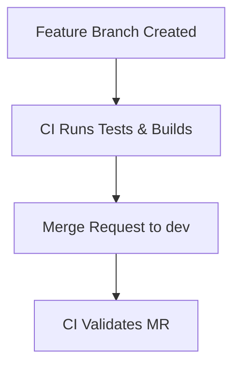
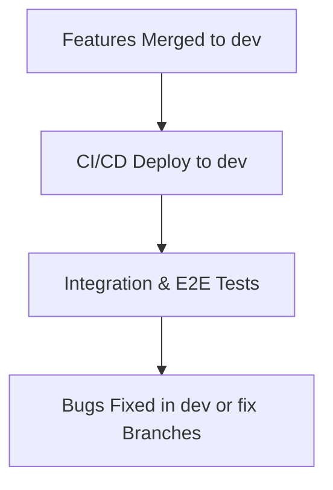
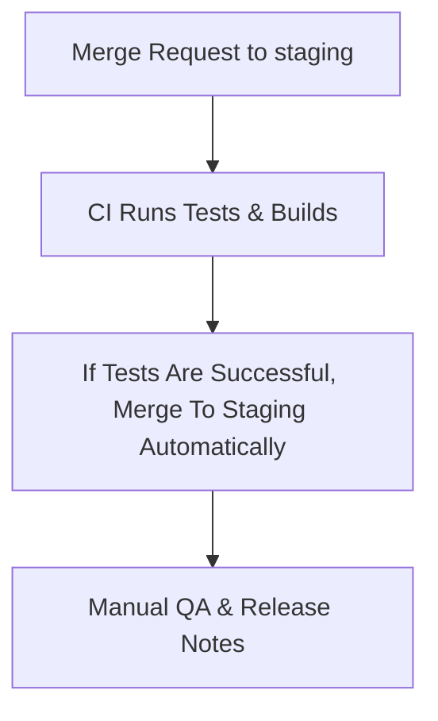
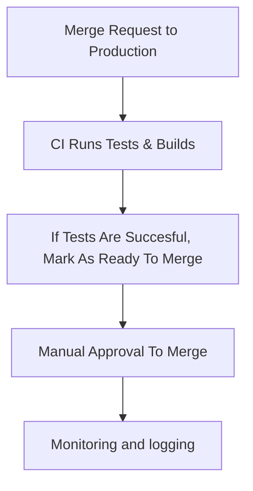
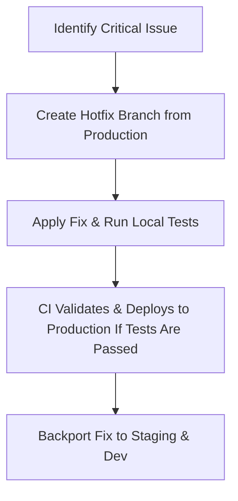
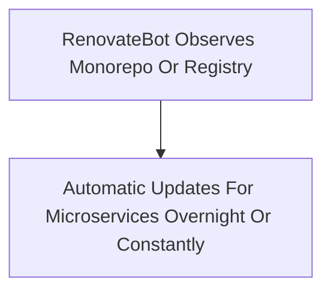
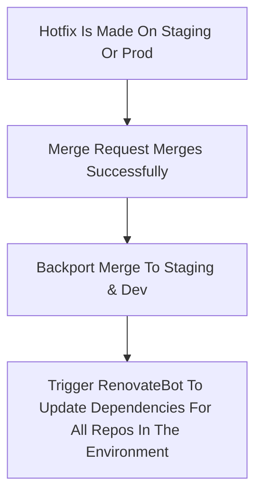
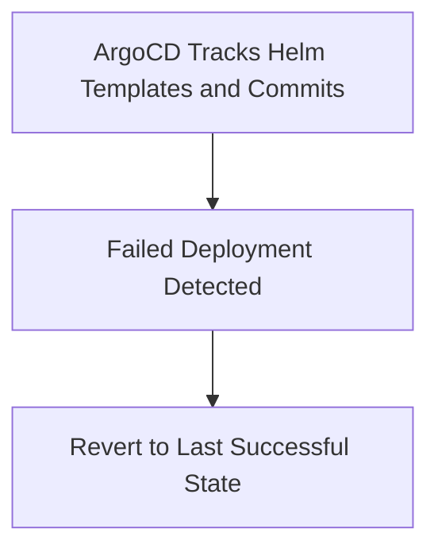
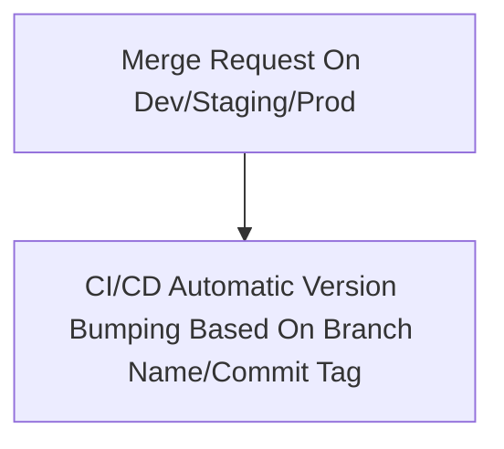

# GitLab Flow

## Table of Contents

0. [Introduction](#introduction)
1. [Our Case](#our-case)
2. [Steps Already Taken, and Where We Can Improve](#steps-already-taken-and-where-we-can-improve)
   - [Separation by Environment, Features, and Fixes](#separation-by-environment-features-and-fixes)
   - [Fast Hotfixes](#possibility-for-fast-hotfixes)
   - [Utilization of a Monorepo](#utilization-of-a-monorepo)
   - [Standard for Version Tagging](#standard-for-version-tagging)
   - [Continuous Testing and Automated Merge Requests](#continuous-testing-and-automated-merge-requests)
3. [Possible solutions](#possible-solutions)
4. [Final Workflow](#final-workflow)
5. [Example Cases](#example-cases)

## Introduction

This repository was created to explain and design what to me would be the best, simplest and faster way
to organize the workflow for a **microservices web application**.

I'm also creating this to better internalize the process and to deline all requirements, problems, and
solution for my use case. All sections of this document are subject to changes.

## Our case

We have an application composed by **multiple** microservices (about 40-50), and we need a simple and efficient
workflow to:

- Handle multiple development environments (dev, staging, production)
- Ensure the **best** code quality possible at each step of our SDLC
- Deploy our code to staging/production and enable **fast and reliable rollbacks**
- Do hotfixes on the fly to resolve urgent bugs or issues on production
- Automate any possible step along the way, to prevent human errors
- Make our developers' life easier

## Steps already taken, and where we can improve

We have already taken the following steps:

- CI/CD pipelines for automated code integration and deployment
- Basic semantic versioning

In the following sections, we will consider all possible improvements to our workflow, and the issues that derive from integrating this processes.

### Separation by environment, features, and fixes

By separating our branches by environment (a branch for dev, a branch
for staging, a branch for production), we can look at the code running directly on the different environments,
making debugging and tracking of the issues easier.

- Creating a branch for each feature AND fixes/hotfixes can improve our workflow. When merging these branches into main,
  we should maintain the Git history and not squash any commits to provide a clearer understanding of each step of our cycle.
  In case of issues, it is easier to debug and fix them.
- Each branch should directly reflect the code running on the environment it corresponds. This approach also enables
  for easier hotfixes in non-dev environments like production and staging.

### Possibility for fast hotfixes

We need to introduce the possibility to make fast fixes in case we find a critical bug in any section of our SDLC.
We could make a simpler CI/CD process for faster deployment, by skipping directly our dev or staging environments.

### Utilization of a monorepo or registry

In my case, the project is split into _several_ different repos, even though the microservices
are tightly interconnected with each other. We could improve our workflow by making a monorepo for our project, although it does
not come with downsides, of course. Not using a monorepo also poses a challenge to track dependencies (both external and internal).

- A valid hybrid approach could be to **keep our dependencies and shared libraries into a monorepo** to track them. This would simplify
  the tracking and version bumping of our dependencies. Through the use of a bot authenticated to a private registry or repo,
  we could automate the dependencies update process of each microservice without any worries, delining possible security issues
  about vulnerable dependencies along the way.

### Standard for version tagging

We need to be aligned on the standard for version tagging. We could utilize
[**Semantic Versioning**](https://semver.org/). Here's a short description on how it would work for us.

- **X.Y.Z** version name, where
  - **X** MUST be incremented if any backward incompatible changes are introduced to the public API. It MAY also include minor and patch level changes. Patch and minor versions MUST be reset to 0 when major version is incremented.
  - **Y** MUST be incremented if new, backward compatible functionality is introduced to the public API. It MUST be incremented if any public API functionality is marked as deprecated. It MAY be incremented if substantial new functionality or improvements are introduced within the private code. It MAY include patch level changes. Patch version MUST be reset to 0 when minor version is incremented.
  - **Z** MUST be incremented if only backward compatible bug fixes are introduced. A bug fix is defined as an internal change that fixes incorrect behavior.
- Tagging our versions based on the environment they are deployed in could also be considered (for example v0.0.1-staging), although it could cause possible
  confusions when applying hotfixes and tracking dependencies. **Semantic Versioning** should be enough, and it easily gives the team an understanding of
  which version of our code is running. **Gradle/Maven tasks or CI/CD pipelines to automatically bump our versions MUST be written to reduce human errors**.
  Using GitLab issues, releases and milestones to track our releases/hotfixes could also improve our workflow by providing a clear and direct perspective on our
  code state and urgent problems.
- At the moment, we are not using version tagging for our Helm final chart. I think we should start doing this to keep a better track of our changes
  and to enable easier rollbacks.

### Continuos Testing and Automated Merge Requests

Our CI/CD processes could be improved to run tests on EVERY Merge Request. This should catch bugs and build errors early
to improve code quality at every step of the way (although it also means more costs regarding runners and computation). Merge Requests should make sure that
the code passes a quality gate, and only then it is merged. From dev to staging it can be automatic, but from staging to production we can require manual input.

## Possible solutions

This is a draft about how I would deal with all the problems considered above:

1. **Branch separation per environment, features** - create a branch for each environment (dev, staging, production), feature, and hotfix.
   Modify our CI/CD processes to adapt to each branch, to directly link our branches to our environments.
   - Automatic tools for promotion to staging or production environments must be built or retrieved to reduce human errors and to track our changes way better.
   - Hotfix branches must follow this convention: `hotfix/<ISSUE_ID>`
     - At the moment this particular step presents a problem for us: the frontend client needs the backend to be working, so features that are actively being developed
       would need to be merged to dev so that the frontend can interact with it. We need to think about a better solution for this.
2. **Easier CI/CD process for hotfixes** - create an easier CI/CD process for hotfixes. Tagging a commit on staging or production branch with _hotfix_ would automatically
   bump our minor version and then deploy the code once tests are passed.
3. **Organization of internal libraries and dependencies in a monorepo** - this would improve their tracking and reduce errors. This would require a lot of effort at the moment.
4. **Utilize Semantic Versioning** - utilizing semantic versioning to track our code changes, using Z (X.Y.Z) for hotfixes only.
   Creation of Maven/Gradle tasks and CI/CD pipelines for automatic version bumping of our microservices and Helm charts.
5. **Enable CI/CD process every step of the way** - run tests and build process for EVERY branch and Merge Requests to catch bugs earlier.
6. **Utilization of ArgoCD and RenovateBot** - setting up _ArgoCD_ to observe our Helm final template (and committing our
   helm template each step of the way into a repo) would make rollbacks easier, and it would provide a clearer and faster understanding of the current state
   of our code. The utilization of _ArgoCD_ also favors [**GitOps**](https://www.redhat.com/en/topics/devops/what-is-gitops#gitops-workflows).
   Utilizing _RenovateBot_ also seems essential to track all our dependencies and to spot security issues as well,
   enhancing security of our application and reducing human errors, keeping every microservice aligned.
   - A nightly Renovate job or deploying it in a Kubernetes pod or virtual machine is enough and is a low cost solution.

## Final Workflow

Here’s the proposed SDLC process:

1. **Feature Development**

   - Developers create feature branches: `feature/<feature-name>`.
   - CI runs unit tests, static analysis, and builds for the branch.
   - Upon completion, create a Merge Request to `dev` branch.
   - CI validates the Merge Request: code quality checks, tests, and build.

2. **Development Environment**

   - Merged features are deployed to `dev` automatically.
   - CI/CD pipelines run integration tests, end-to-end tests, version bumping, and deployment.
   - Bugs found are fixed in `dev` or `fix/<issue-id>` branches.

3. **Staging Environment**

   - Features deemed stable are promoted to `staging` via Merge Request.
   - CI/CD deploys to staging and runs tests.
   - Manual QA is performed, and release notes are prepared.
  

4. **Production Environment**

   - Approved changes are merged to `production` via Merge Request.
   - CI/CD deploys to production.
   - Monitoring and logging systems ensure stability.

5. **Hotfix Process**

   - For critical issues, create `hotfix/<issue-id>` from `production`.
   - CI validates and deploys directly to production after tests pass.
   - Hotfix is backported (merging hotfix branch) to `staging` and `dev` to sync environments.

6. **Dependency Management**

   - Use RenovateBot for dependency updates of our microservices.
   - Dependencies should be kept in a monorepo or a registry

6.5 **Dependency Management in case of a hotfix for library**

   - Trigger a RenovateBot job to update dependencies for the preceding environments.
   - Job should only be triggered when the Merge Request of the hotfix merged successfully.

7. **Rollback Mechanism**

   - ArgoCD tracks Helm templates and commits for easy rollback.
   - Failed deployments can revert to the last successful state.

8. **Version Management**

   - Semantic Versioning: Increment patch for hotfixes, minor for new features, major for breaking changes.
   - CI automates version bumps and tags releases following semantic versioning **X.Y.Z* where
   -    - X is a major, incompatible version with precedent APIs
        - Y is a retrocompatible update, can be fixes or new features.
        - Z is a bugfix or minor fix. 
  

9. **Continuous Improvement**
   - All steps logged in GitLab Issues and Milestones.
   - Regular retrospectives to refine workflows.

# Example Cases

## Hotfix example cases

### Scenario 1: Bug in Shared Library (Affects Production)

A critical bug is discovered in a shared library used by multiple microservices. This bug is impacting production and must be fixed immediately.

**Steps:**

1. **Create Hotfix Branch**  
   Create a branch from the `production` branch:  
   `hotfix/library-bugfix-prod`.

2. **Apply Fix**  
   Fix the bug in the shared library repository. Ensure the change is backward-compatible if possible.

3. **Test Locally**  
   Run local tests for all dependent services using the updated library.

4. **Push on hotfix branch**  
   Push changes to the hotfix branch. CI validates the fix with static analysis, unit tests, and build pipelines.

5. **Create Merge Request**
   Once changes are finalized, create a Merge Request that merges `hotfix/library-bugfix-prod` to `production`

6. **Run CI**
   Pipelines run tests and compilation on the merge request to ensure code quality. If code meets quality gate standards, merge upon manual intervention.

8. **Deploy to Production**  
   CI/CD bumps version for hotfix (e.g., `v1.2.1`) and deploys the updated library to production and our artifact registry/monorepo.
   Use **ArgoCD** or equivalent to track and validate deployment.

9. **Backport Fix**  
   Merge the hotfix branch automatically into both `staging` and `dev` branches to synchronize all environments. This should be done if MR was merged successfully.
   - If there are versions conflicts (for example on dev `v1.3.0` and on prod `v1.2.1`, a manual cherry pick or merge of the hotfix is required)

11. **Trigger RenovateBot**
    Trigger RenovateBot for both staging and dev to update microservices dependencies. Merge Requests should be automatically merged if tests are positive.

---

### Scenario 2: Bug in Shared Library (Affects Staging)

**Description:**  
A bug is detected in a shared library during staging testing. This bug must be fixed and validated before moving to production.

**Steps:**

1. **Create Hotfix Branch**  
   Create a branch from the `staging` branch:  
   `hotfix/library-bugfix-staging`.

2. **Apply Fix**  
   Fix the issue in the shared library and ensure backward compatibility if possible.

3. **Test Locally**  
   Run local tests for all dependent services using the updated library.

4. **Push on hotfix branch**  
   Push changes to the hotfix branch. CI validates the fix with static analysis, unit tests, and build pipelines.

5. **Create Merge Request**
   Once changes are finalized, create a Merge Request that merges `hotfix/library-bugfix-staging` to `staging`

6. **Run CI**
   Pipelines run tests and compilation on the merge request to ensure code quality. If code meets quality gate standards, merge upon manual intervention OR automatically since we're in staging environment.

7. **Deploy to Staging**  
   CI/CD bumps version for hotfix (e.g., `v1.2.1`) and deploys the updated library to staging and our artifact registry/monorepo.
   Use **ArgoCD** or equivalent to track and validate deployment.

8. **QA and Validation**  
   Perform manual or automated QA in the staging environment. Ensure there are no regressions or side effects before going forward.

9. **Backport Fix**
   Merge/cherry pick the hotfix branch into `dev` branch to synchronize staging and dev environments. This should be done if MR was merged successfully.
   - If there are versions conflicts (for example on dev `v1.3.0` and on prod `v1.2.1`, a manual cherry pick or merge of the hotfix is required)

11. **Trigger RenovateBot**
    Trigger RenovateBot for dev environment to update microservices dependencies. Merge Requests should be automatically merged if tests are positive.

---

### Scenario 3: Bug in Microservice (Affects Production)

**Description:**  
A critical issue is discovered in a single microservice running in production. This issue requires an immediate fix and deployment.

**Steps:**

1. **Create Hotfix Branch**  
   Create a branch from the `production` branch:  
   `hotfix/ms-bugfix-prod`.

2. **Apply Fix**  
   Fix the issue in the microservice. Ensure it doesn’t introduce further breaking changes.

3. **Test Locally**  
   Run unit tests and integration tests for the microservice.

4. **Push on hotfix branch**  
   Push the changes to the hotfix branch. CI validates the fix with static analysis, unit tests, and build pipelines.

5. **Create Merge Request**
   Once changes are finalized, create a Merge Request that merges `hotfix/ms-bugfix-prod` to `production`.

6. **Run CI**
   Pipelines run tests and compilation on the merge request to ensure code quality. If code meets quality gate standards, merge upon manual intervention.

7. **Deploy to Production**  
   CI/CD bumps version for hotfix (e.g., `v2.3.4`) and deploys the updated microservice to production.

8. **Backport Fix**  
   Merge the hotfix branch into `staging` and `dev` branches to ensure all environments are synchronized. This should be done if MR was merged successfully.
   - If there are versions conflicts (for example on dev `v1.3.0` and on prod `v1.2.1`, a manual cherry pick or merge of the hotfix is required)

---

### Scenario 4: Bug in Microservice (Affects Staging)

**Description:**  
A bug is found in a microservice during staging testing. This needs a fix before promoting to production.

**Steps:**

1. **Create Hotfix Branch**  
   Create a branch from the `staging` branch:  
   `hotfix/ms-bugfix-staging`.

2. **Apply Fix**  
   Fix the bug in the microservice. Ensure backward compatibility and no new issues.

3. **Test Locally**  
   Run unit tests and integration tests for the microservice.

4. **Push on hotfix branch**  
   Push the changes to the hotfix branch. The CI pipeline validates the fix with tests and builds.

5. **Create Merge Request**
   Once changes are finalized, create a Merge Request that merges `hotfix/ms-bugfix-staging` to `staging`

6. **Run CI**
   Pipelines run tests and compilation on the merge request to ensure code quality. If code meets quality gate standards, merge upon manual intervention.

7. **Deploy to Staging**  
   CI/CD bumps version for hotfix (e.g., `v2.3.4`) and deploys the updated microservice to staging.

8. **Backport Fix**
   Merge automatically the hotfix branch into `dev` to ensure both environments are synchronized.
   - If there are versions conflicts (for example on dev `v1.3.0` and on prod `v1.2.1`, a manual cherry pick or merge of the hotfix is required)

---

It would be optimal to follow these steps as well each time a hotfix is applied:
- Log hotfix progress and outcomes in GitLab Issues/Milestones to keep the team informed.
