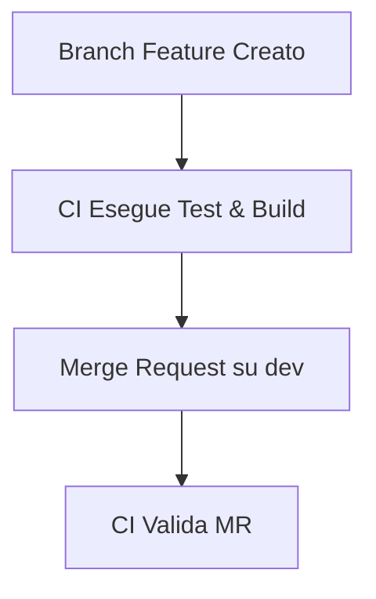
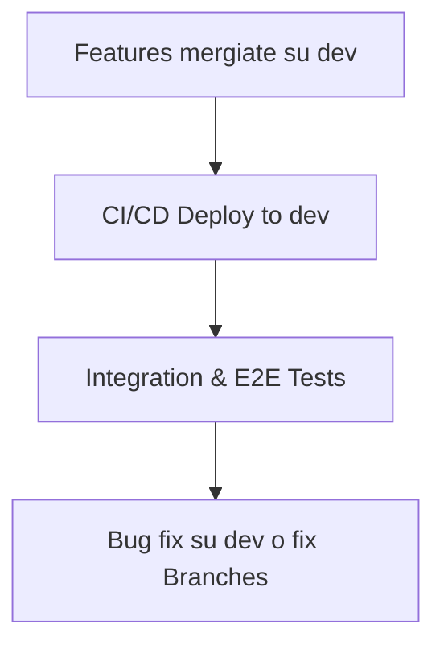
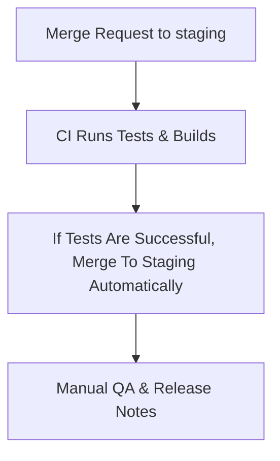
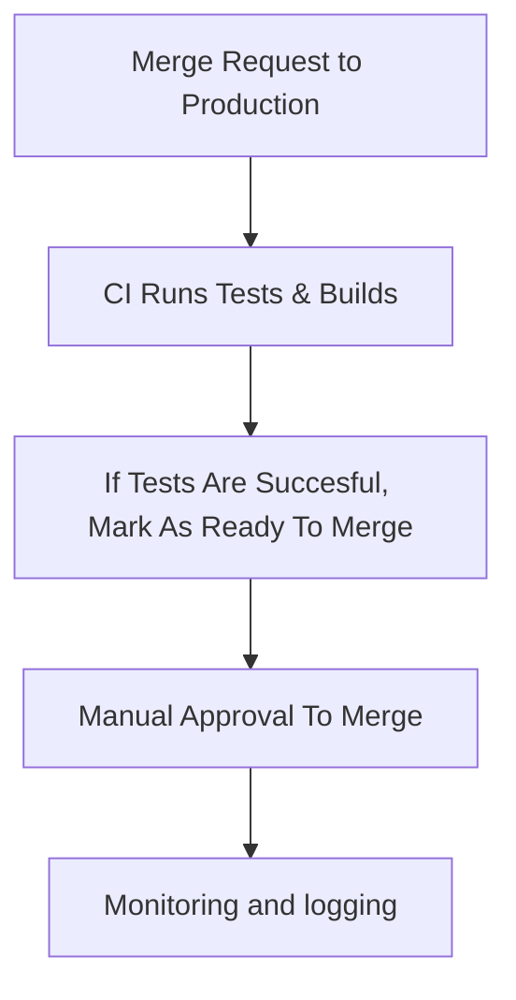
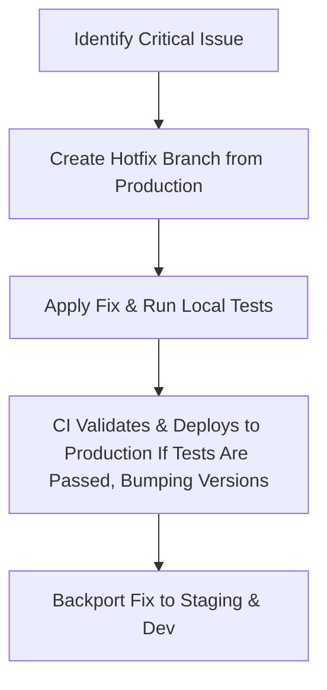
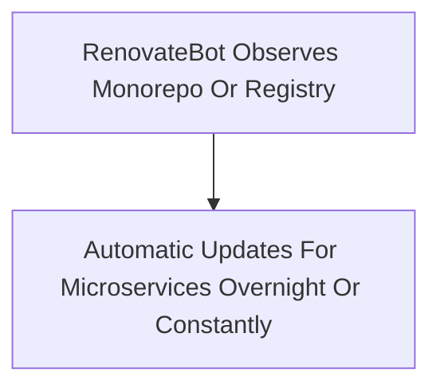
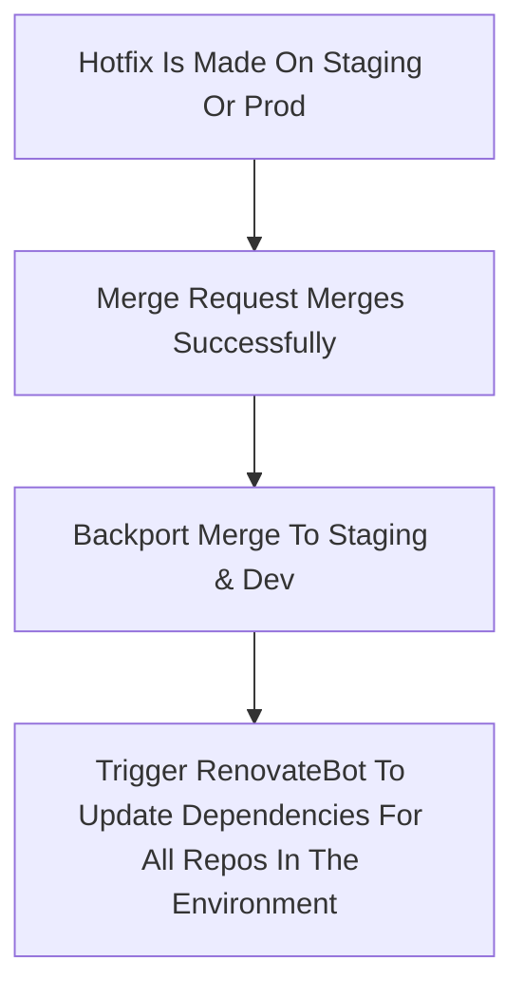
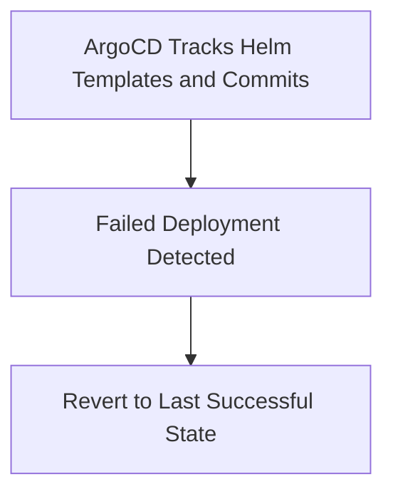
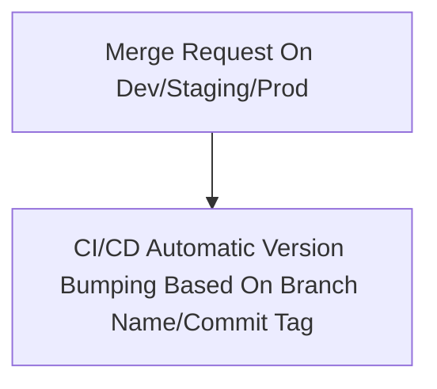

# GitLab Flow

**ATTENZIONE: consiglio caldamente di leggere il documento dalla main branch in inglese in quanto questa versione del documento
è stata tradotta automaticamente in italiano da un LLM.
La traduzione potrebbe contenere errori di battitura, traduzione, o altro. Più avanti la tradurrò a mano e per bene.**

## Indice

0. [Introduzione](#introduzione)  
1. [Il Nostro Caso](#il-nostro-caso)  
2. [Passi Già Compiuti e Dove Possiamo Migliorare](#passi-già-compiuti-e-dove-possiamo-migliorare)  
   - [Separazione per Ambiente, Funzionalità e Correzioni](#separazione-per-ambiente-funzionalità-e-correzioni)  
   - [Hotfix Rapidi](#hotfix-rapidi)  
   - [Utilizzo di un Monorepo](#utilizzo-di-un-monorepo)  
   - [Standard per il Version Tagging](#standard-per-il-version-tagging)  
   - [Test Continuo e Merge Request Automatizzati](#test-continuo-e-merge-request-automatizzati)  
3. [Possibili Soluzioni](#possibili-soluzioni)  
4. [Workflow Finale](#workflow-finale)  
5. [Casi Esempio](#casi-di-esempio)  

## Introduzione

Questo repository è stato creato per spiegare e progettare quello che, secondo me, rappresenterebbe il modo migliore, più semplice e veloce per organizzare il workflow di un'applicazione **web a microservizi**.

Sto anche creando questo documento per interiorizzare meglio il processo e delineare tutti i requisiti, problemi e soluzioni per il mio caso d'uso. Tutte le sezioni di questo documento sono soggette a modifiche.

## Il Nostro Caso

Abbiamo un'applicazione composta da **molti** microservizi (circa 40-50), e abbiamo bisogno di un workflow semplice ed efficiente per:

- Gestire diversi ambienti di sviluppo (dev, staging, produzione)  
- Garantire la **migliore** qualità del codice possibile in ogni fase del nostro SDLC  
- Distribuire il nostro codice su staging/produzione e consentire rollback **veloci e affidabili**  
- Applicare hotfix al volo per risolvere bug o problemi urgenti in produzione  
- Automatizzare ogni possibile passaggio lungo il processo, per prevenire errori umani  
- Rendere la vita dei nostri sviluppatori più facile  

## Passi già compiuti e dove possiamo migliorare

Abbiamo già implementato i seguenti passi:  

- Pipeline CI/CD per l'integrazione e la distribuzione automatica del codice  
- Versionamento semantico di base  

Nelle sezioni seguenti, prenderemo in considerazione tutti i possibili miglioramenti del nostro workflow e i problemi derivanti dall'integrazione di questi processi.

### Separazione per ambiente, funzionalità e correzioni

Separando i branch per ambiente (un branch per dev, uno per staging e uno per produzione), possiamo osservare il codice che gira direttamente nei diversi ambienti, facilitando il debug e il tracciamento dei problemi.  

- Creare un branch per ogni funzionalità **e** correzione/hotfix potrebbe migliorare il nostro workflow. Durante il merge di questi branch nel branch principale, dovremmo mantenere la cronologia Git senza fare squash dei commit per fornire una comprensione più chiara di ogni fase del ciclo. In caso di problemi, è più facile eseguire il debug e risolverli.  
- Ogni branch dovrebbe riflettere direttamente il codice in esecuzione nell'ambiente corrispondente. Questo approccio semplifica anche gli hotfix in ambienti non di sviluppo come produzione e staging.  

### Hotfix Rapidi

Dobbiamo introdurre la possibilità di applicare rapidamente correzioni nel caso in cui troviamo un bug critico in qualsiasi sezione del nostro SDLC. Potremmo rendere più semplice il processo CI/CD per distribuzioni rapide, saltando direttamente gli ambienti dev o staging.

### Utilizzo di un Monorepo

Nel nostro caso, il progetto è suddiviso in **diversi** repository, anche se i microservizi sono strettamente interconnessi tra loro. Potremmo migliorare il nostro workflow utilizzando un monorepo per il nostro progetto, anche se ciò comporta alcuni svantaggi. Non utilizzare un monorepo rappresenta una sfida per tracciare le dipendenze (sia esterne che interne).  

- Un approccio ibrido valido potrebbe essere quello di **conservare le nostre dipendenze e librerie condivise in un monorepo** per tracciarle. Ciò semplificherebbe il tracciamento e l'aggiornamento delle versioni delle dipendenze. Attraverso l'uso di un bot autenticato su un registro o repository privato, potremmo automatizzare il processo di aggiornamento delle dipendenze di ciascun microservizio senza preoccupazioni, eliminando possibili problemi di sicurezza derivanti da dipendenze vulnerabili lungo il percorso.  

### Standard per il Version Tagging

### Standard per il Version Tagging

Dobbiamo allinearci su uno standard per il version tagging. Potremmo utilizzare [**Semantic Versioning**](https://semver.org/). Ecco una breve descrizione di come funzionerebbe per noi.  

- **X.Y.Z**, dove:
  - **X** deve essere incrementato in caso di modifiche retroincompatibili nell'API pubblica.
  - **Y** deve essere incrementato per nuove funzionalità retrocompatibili o funzionalità deprecate.
  - **Z** deve essere incrementato per bugfix retrocompatibili.  

Usare il tagging per ambiente (es. `v0.0.1-staging`) potrebbe essere considerato, anche se rischierebbe di creare confusione durante l'applicazione di hotfix.  

L'utilizzo del **Semantic Versioning** dovrebbe essere sufficiente per fornire al team una chiara comprensione della versione del codice in esecuzione. Task automatizzati in Gradle/Maven o pipeline CI/CD per incrementare automaticamente le versioni DEVONO essere creati per ridurre al minimo gli errori umani.  

Inoltre, l'utilizzo di GitLab Issues, Releases e Milestones per tracciare rilasci e hotfix potrebbe migliorare il nostro flusso di lavoro fornendo una visione chiara e diretta sullo stato del nostro codice e sui problemi urgenti.  

Attualmente non utilizziamo il version tagging per il nostro Helm final chart. Penso che dovremmo iniziare a farlo per tracciare meglio i cambiamenti e abilitare rollback più semplici.

## Test Continuo e Merge Request Automatizzate

I nostri processi CI/CD potrebbero essere migliorati eseguendo test su **ogni** branch e Merge Request. Questo ci permetterebbe di identificare bug e problemi di build in anticipo, migliorando la qualità del codice in ogni fase del ciclo di vita (anche se ciò comporta costi aggiuntivi per runner e risorse computazionali).  

Le Merge Request dovrebbero garantire che il codice superi un "quality gate" prima di essere accettato.  

- Da `dev` a `staging` il processo potrebbe essere automatico.  
- Da `staging` a `production` richiedere una revisione manuale.

---

## Soluzioni Possibili

Questo è un abbozzo di come affrontare i problemi descritti:

1. **Separazione dei branch per ambiente e funzionalità**  
   Creare branch per ogni ambiente (`dev`, `staging`, `production`), feature e hotfix.  
   Modificare i processi CI/CD per adattarli ai branch, collegando direttamente i branch agli ambienti.  
   - Strumenti automatici per la promozione tra ambienti (staging → production) dovrebbero essere costruiti o adottati per ridurre errori umani e tracciare meglio le modifiche.
   - I branch hotfix dovrebbero seguire questa convenzione: `hotfix/<ISSUE_ID>`.
     - Problema attuale: il frontend necessita che il backend sia funzionante, quindi le feature in sviluppo attivo potrebbero dover essere mergeate su `dev` affinché il frontend possa interagire con esse. È necessaria una soluzione migliore.

2. **Processo CI/CD semplificato per gli hotfix**  
   Creare un processo CI/CD più rapido per gli hotfix. Taggare un commit su `staging` o `production` con _hotfix_ dovrebbe incrementare automaticamente la minor version e distribuire il codice una volta superati i test.

3. **Organizzazione delle librerie e dipendenze interne in un monorepo**  
   Questo migliorerebbe il tracciamento e ridurrebbe gli errori, ma richiederebbe uno sforzo iniziale significativo.

4. **Utilizzo del Semantic Versioning**  
   Tracciare i cambiamenti del codice utilizzando il Semantic Versioning, riservando `Z` (X.Y.Z) esclusivamente agli hotfix.  
   Creazione di task Maven/Gradle e pipeline CI/CD per l’incremento automatico delle versioni dei microservizi e dei chart Helm.

5. **Abilitare processi CI/CD in ogni fase**  
   Eseguire test e build su ogni branch e Merge Request per individuare bug precocemente.

6. **Utilizzo di ArgoCD e RenovateBot**  
   - Configurare **ArgoCD** per osservare i template Helm finali, impegnandoli in un repository per rendere i rollback più semplici.  
     L’utilizzo di ArgoCD promuove anche [**GitOps**](https://www.redhat.com/en/topics/devops/what-is-gitops#gitops-workflows).
   - Configurare **RenovateBot** per monitorare le dipendenze, segnalare vulnerabilità e mantenere i microservizi aggiornati.  
     - Un job notturno di Renovate o la sua esecuzione in un pod Kubernetes è sufficiente e a basso costo.

---

## Workflow Finale

### 1. **Sviluppo delle funzionalità**

- I developer creano branch di funzionalità: `feature/<nome-funzionalità>`.
- CI esegue test unitari, analisi statica e build sul branch.
- A completamento, viene creata una Merge Request verso il branch `dev`.
- CI valida la Merge Request con controlli di qualità, test e build.

2. **Ambiente di Development**

   - Feature mergiate su `dev` sono deployate automaticamente.
   - CI pipelines eseguono integration tests, end-to-end tests, version bumping, e deployment.
   - Bug trovati sono sistemati su branch di `dev` o `fix/<issue-id>`.

3. **Ambiente di Staging**

   - Features stabili sono "promosse" a `staging` attraverso una Merge Request da `dev` a `staging` branch.
   - CI/CD schiera su staging ed esegue i test.
   - QA manuale, preparazione delle release notes.
  

4. **Ambiente di Produzione**

   - I cambiamenti approvati vengono mergiati su `production` attraverso una Merge Request da `staging` a `production`.
   - CI/CD pipeline schierano il codice su produzione solo dopo che i test sono andati a buon fine e un approvazione manuale.
   - Monitoramento dei log e della salute dei sistemi per verificare che tutto sia andato a buon fine.

5. **Hotfix Process**

   - Per problemi e bug urgenti, creare una branch `hotfix/<issue-id>` da `production`.
   - CI/CD pipelines validano e schierano direttamente su `production` dopo che i test sono andati a buon fine, effettuando il bumping delle versioni.
   - Hotfix viene mergiato successivamente su `staging` e `dev` per sincronizzare gli environment.

6. **Gestione delle dipendenze**

   - Usare RenovateBot per aggiornamento delle dipendendenze dei microservizi e delle librerie.
   - Le dipendenze dovrebbero essere mantenute in una monorepo o artifact registry osservati da RenovateBot.

6.5 **Gestione delle dipendenze in caso di hotfix**

   - Triggerare un RenovateBot job per aggiornare le dipendenze degli environment antecedenti.
   - Il job deve essere triggerato automaticamente quando la Merge Request dell'hotfix è andata a buon fine.

7. **Meccanismo di Rollback**

   - ArgoCD traccia gli Helm templates e i commit per un rollback facile.
   - Deployment falliti possono essere facilmente revertati all'ultima versione stabile.

8. **Version Management**

   - **Semantic Versioning**: Incrementa la patch per gli hotfix, il minor per nuove funzionalità e il major per modifiche retroincompatibili.
   - La CI automatizza l'incremento delle versioni e i tag delle release seguendo il Semantic Versioning **X.Y.Z**, dove:
     - **X** rappresenta una versione major, retroincompatibile con le API precedenti.
     - **Y** rappresenta un aggiornamento retrocompatibile, che può includere correzioni o nuove funzionalità.
     - **Z** rappresenta un bugfix o una correzione minore.
  

9. **Continuous Improvement**
   - Tutti gli step di hotfix e deployment dovrebbero essere loggati tramite GitLab issues e Milestones.
   - Imparare dai propri errori e migliorare il workflow nel corso del tempo.

# Casi di Esempio

## Esempi di Hotfix

### Scenario 1: Bug in una Libreria Condivisa (Impatta la Produzione)

Un bug critico è stato scoperto in una libreria condivisa utilizzata da più microservizi. Questo bug sta impattando la produzione e deve essere risolto immediatamente.

**Passaggi:**

1. **Creare un Branch Hotfix**  
   Creare un branch a partire dal branch `production`:  
   `hotfix/library-bugfix-prod`.

2. **Applicare la Correzione**  
   Risolvere il bug nel repository della libreria condivisa. Assicurarsi che la modifica sia retrocompatibile, se possibile.

3. **Testare Localmente**  
   Eseguire test locali per tutti i servizi dipendenti utilizzando la libreria aggiornata.

4. **Push sul Branch Hotfix**  
   Effettuare il push delle modifiche sul branch hotfix. La CI valida la correzione con analisi statica, test unitari e pipeline di build.

5. **Creare una Merge Request**  
   Una volta finalizzate le modifiche, creare una Merge Request per unire `hotfix/library-bugfix-prod` a `production`.

6. **Eseguire la CI**  
   Le pipeline eseguono test e compilazione sulla Merge Request per garantire la qualità del codice. Se il codice soddisfa gli standard di qualità, unire con intervento manuale.

7. **Distribuire in Produzione**  
   La CI/CD incrementa la versione per l'hotfix (es. `v1.2.1`) e distribuisce la libreria aggiornata in produzione e nel nostro registro degli artefatti/monorepo.  
   Utilizzare **ArgoCD** o un equivalente per tracciare e validare la distribuzione.

8. **Portare la Correzione sui Branch Secondari**  
   Unire automaticamente il branch hotfix nei branch `staging` e `dev` per sincronizzare tutti gli ambienti. Questo passaggio dovrebbe avvenire se la Merge Request è stata unita con successo.

9. **Attivare RenovateBot**  
   Attivare RenovateBot sia per `staging` che per `dev` per aggiornare le dipendenze dei microservizi. Le Merge Request devono essere automaticamente unite se i test sono positivi.

---

### Scenario 2: Bug in una Libreria Condivisa (Impatta lo Staging)

**Descrizione:**  
Un bug è stato rilevato in una libreria condivisa durante i test in staging. Questo bug deve essere corretto e validato prima di passare in produzione.

**Passaggi:**

1. **Creare un Branch Hotfix**  
   Creare un branch a partire dal branch `staging`:  
   `hotfix/library-bugfix-staging`.

2. **Applicare la Correzione**  
   Risolvere il problema nella libreria condivisa, assicurandosi che sia retrocompatibile, se possibile.

3. **Testare Localmente**  
   Eseguire test locali per tutti i servizi dipendenti utilizzando la libreria aggiornata.

4. **Push sul Branch Hotfix**  
   Effettuare il push delle modifiche sul branch hotfix. La CI valida la correzione con analisi statica, test unitari e pipeline di build.

5. **Creare una Merge Request**  
   Una volta finalizzate le modifiche, creare una Merge Request per unire `hotfix/library-bugfix-staging` a `staging`.

6. **Eseguire la CI**  
   Le pipeline eseguono test e compilazione sulla Merge Request per garantire la qualità del codice. Se il codice soddisfa gli standard di qualità, unire manualmente o automaticamente, poiché ci troviamo nell'ambiente di staging.

7. **Distribuire in Staging**  
   La CI/CD incrementa la versione per l'hotfix (es. `v1.2.1`) e distribuisce la libreria aggiornata in staging e nel nostro registro degli artefatti/monorepo.  
   Utilizzare **ArgoCD** o un equivalente per tracciare e validare la distribuzione.

8. **QA e Validazione**  
   Eseguire QA manuale o automatizzato nell'ambiente di staging. Assicurarsi che non ci siano regressioni o effetti collaterali prima di procedere.

9. **Portare la Correzione su Dev**  
   Unire automaticamente il branch hotfix nel branch `dev` per sincronizzare staging e dev. Questo passaggio dovrebbe avvenire se la Merge Request è stata unita con successo.

10. **Attivare RenovateBot**  
    Attivare RenovateBot per l'ambiente di sviluppo per aggiornare le dipendenze dei microservizi. Le Merge Request devono essere automaticamente unite se i test sono positivi.

---

### Scenario 3: Bug in un Microservizio (Impatta la Produzione)

**Descrizione:**  
Un problema critico è stato scoperto in un microservizio in esecuzione in produzione. Questo problema richiede una correzione e distribuzione immediate.

**Passaggi:**

1. **Creare un Branch Hotfix**  
   Creare un branch a partire dal branch `production`:  
   `hotfix/ms-bugfix-prod`.

2. **Applicare la Correzione**  
   Risolvere il problema nel microservizio, assicurandosi che non introduca ulteriori modifiche incompatibili.

3. **Testare Localmente**  
   Eseguire test unitari e test di integrazione per il microservizio.

4. **Push sul Branch Hotfix**  
   Effettuare il push delle modifiche sul branch hotfix. La CI valida la correzione con analisi statica, test unitari e pipeline di build.

5. **Creare una Merge Request**  
   Una volta finalizzate le modifiche, creare una Merge Request per unire `hotfix/ms-bugfix-prod` a `production`.

6. **Eseguire la CI**  
   Le pipeline eseguono test e compilazione sulla Merge Request per garantire la qualità del codice. Se il codice soddisfa gli standard di qualità, unire con intervento manuale.

7. **Distribuire in Produzione**  
   La CI/CD incrementa la versione per l'hotfix (es. `v2.3.4`) e distribuisce il microservizio aggiornato in produzione.

8. **Portare la Correzione su Staging e Dev**  
   Unire il branch hotfix nei branch `staging` e `dev` per assicurare la sincronizzazione degli ambienti. Questo passaggio dovrebbe avvenire se la Merge Request è stata unita con successo.

---

### Scenario 4: Bug in un Microservizio (Impatta lo Staging)

**Descrizione:**  
Un bug è stato trovato in un microservizio durante i test in staging. È necessario risolverlo prima della promozione in produzione.

**Passaggi:**

1. **Creare un Branch Hotfix**  
   Creare un branch a partire dal branch `staging`:  
   `hotfix/ms-bugfix-staging`.

2. **Applicare la Correzione**  
   Risolvere il problema nel microservizio, assicurandosi che sia retrocompatibile e non introduca nuovi problemi.

3. **Testare Localmente**  
   Eseguire test unitari e test di integrazione per il microservizio.

4. **Push sul Branch Hotfix**  
   Effettuare il push delle modifiche sul branch hotfix. La CI valida la correzione con analisi statica, test unitari e pipeline di build.

5. **Creare una Merge Request**  
   Una volta finalizzate le modifiche, creare una Merge Request per unire `hotfix/ms-bugfix-staging` a `staging`.

6. **Eseguire la CI**  
   Le pipeline eseguono test e compilazione sulla Merge Request per garantire la qualità del codice. Se il codice soddisfa gli standard di qualità, unire con intervento manuale.

7. **Distribuire in Staging**  
   La CI/CD incrementa la versione per l'hotfix (es. `v2.3.4`) e distribuisce il microservizio aggiornato in staging.

8. **Portare la Correzione su Dev**  
   Unire automaticamente il branch hotfix nel branch `dev` per sincronizzare staging e dev.

---

**Nota:**  
Si consiglia di registrare i progressi e gli esiti degli hotfix nelle Issue/Milestone di GitLab per tenere il team informato.
